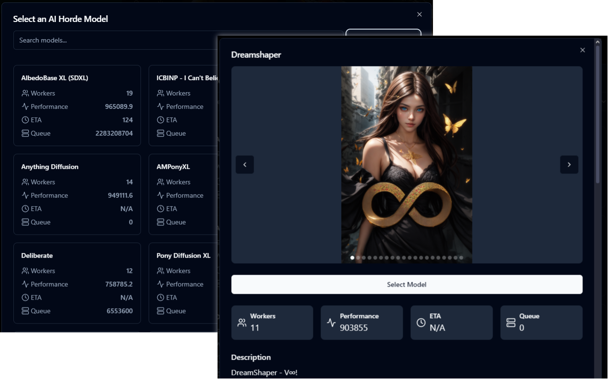
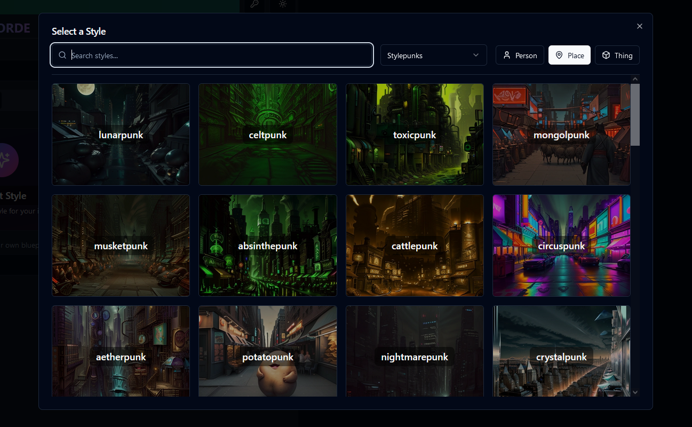
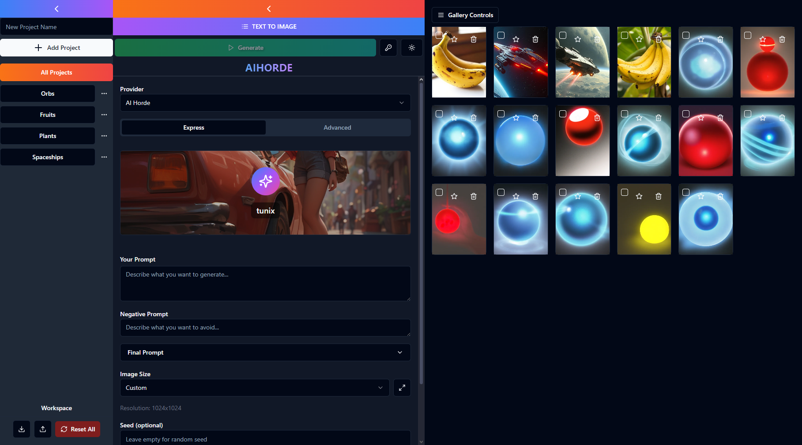
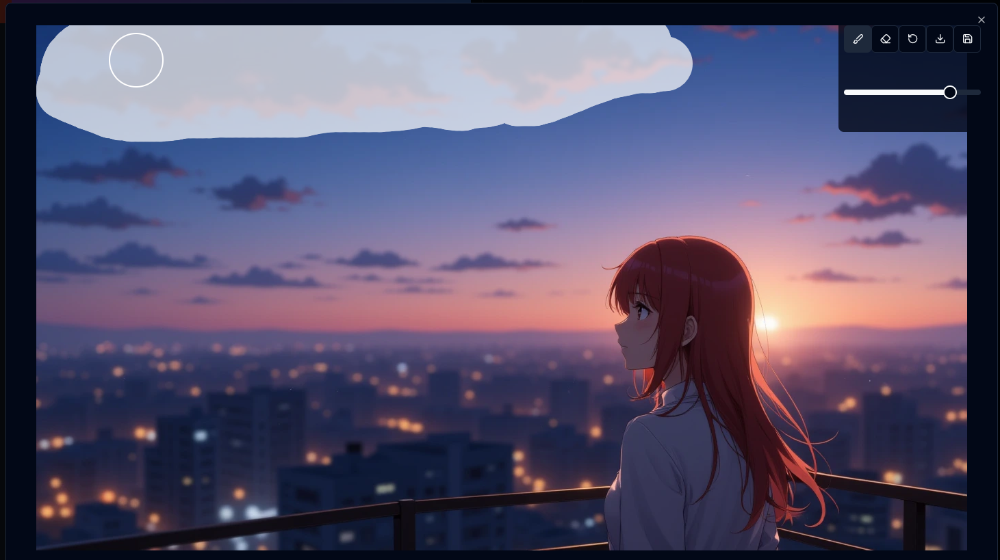
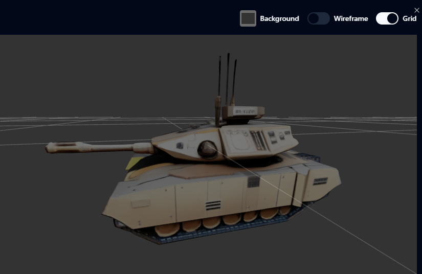

# CallerBot AI Image Gen

Built with Vite and ShadCN UI that empowers content creators to seamlessly generate images and 3D models. Switch effortlessly between services like AI Horde and HuggingFace to create your content.

## Getting Started

1. Install dependencies:
   ```bash
   npm install
   ```

2. Start the development server:
   ```bash
   npm run dev
   ```

3. Access the application at `http://localhost:5173`

## Features
- 🎨 Generate images using multiple AI providers
- 🔄 Easy switching between different AI endpoints
- 🖼️ Built-in gallery for managing generated content
- 🎭 Mask editing capabilities
- 🚀 Express mode for quick generations
- 🔍 Integrated CivitAI model search
- 🎲 3D model generation and viewing
- 🖌️ Multiple style presets for image generation

## Screenshots
### Model Selection

Choose from a variety of AI models to achieve your desired results.

### Style Presets

Quick access to different style presets for consistent image generation.

### Text to Image Generation

Generate stunning images from text descriptions using multiple AI providers.

### Inpainting

Select only parts of the image for generation

### Image to 3D Model Generation

Bring your 2D images to life!

## API Tokens

### AI Horde
A default community token is provided with the application that comes loaded with kudos!

### HuggingFace
You'll need to register for a free HuggingFace account and use your token. Free accounts receive approximately 200 H100 GPU seconds per day.

### Fyrean
The 3D model generation [TRELLIS](https://github.com/microsoft/TRELLIS) is hosted by me on my potato PC, no API key needed but will probably get overwhelmed during high demand times.

## Directory Structure

```
├── src/                        # Main React application source code
│   ├── components/             # UI components (its a mess though)
│   │   ├── gallery/            # Gallery-related components
│   │   └── ui/                 # ShadCN UI components
│   ├── hooks/                  # ShadCN hooks
│   └── lib/                    # Utility functions
```

## Key Components

### Frontend Application (`src/`)
- `AIHordeProvider.jsx`, `DeepInfraProvider.jsx`, `HuggingFaceProvider.jsx`: Provider integrations for different AI services
- `ProjectGallery.jsx`: Main gallery interface for viewing and managing AI-generated content
- `CivitAISearch.jsx`: Interface for searching and selecting AI models
- `ImageDetailsModal.jsx`: Detailed view for generated images
- `MaskEditor.jsx`: Image mask editing functionality
- `ExpressMode.jsx`: Streamlined AIhorde interface for quick image generation

### Gallery Components (`src/components/gallery/`)
- `GenerationPanel.jsx`: Controls for AI content generation
- `ImageGrid.jsx`: Display grid for generated content
- `Sidebar.jsx`: Project organization panel

## Key Files for Review

1. **Core Application Logic**
   - `src/App.jsx`: Main application component
   - `src/main.jsx`: Application entry point

2. **Provider Implementations**
   - `src/AIHordeProvider.jsx`
   - `src/DeepInfraProvider.jsx`
   - `src/HuggingFaceProvider.jsx`

3. **Gallery Implementation**
   - `src/ProjectGallery.jsx`
   - `src/components/gallery/ImageGrid.jsx`
   - `src/components/gallery/GenerationPanel.jsx`